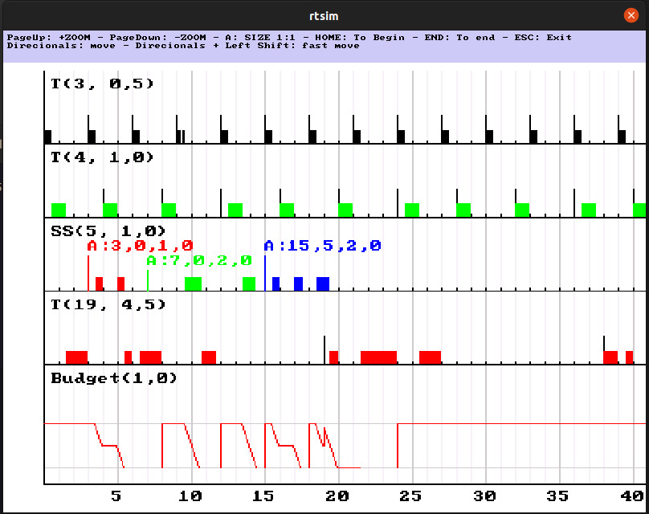

# RTSim

FEDERAL UNIVERSITY OF SANTA CATARINA - UFSC \
POSTGRADUATE PROGRAM IN AUTOMATION AND SYSTEMS ENGINEERING - PPGEAS \
Class: DAS6663 - Real Time Systems \
Author: Saulo Popov Zambiasi \
Software: RTSim \
Date: November 22, 2006

## About

RTSim is a program to calculate and visualize tasks of a real-time system.

I developed this program in C++ and Allegro 4 language during the discipline of Real Time Systems during the doctorate in the Graduate Program in Automation and Systems Engineering in 2006. The program was not part of the discipline and I developed it only as a hobby. However, I ended up using it as a tool to test and validate the exercises.



## How to Use

Input files must have the `.in` extension and must contain the information of the tasks to be calculated. For example:

File: `janeliu.in`

```
periodic 3 0,5 0 0 0
periodic 4 1,0 0 255 0
periodic 19 4,5 255 0 0
simple_sporadic_server 5 1.5 100 100 255
aperiodic 3 1,0 255 0 0
aperiodic 7 2,0 0 255 0
aperiodic 15,5 2,0 0 0 255
```

* `periodic`: create a periodic task with following parameters:
  * Period
  * Computation time
  * Colors Red, Green and Blue
* `simple_sporatic_server`:
  * Each x time
  * Computation time
  * Colors Red, Green and Blue

Running:

```
./rtsim samples/janeliu.in
```

It will generate 2 files:

* `janeliu.out`: with text results
* `janeliu.bmp`: with image result
